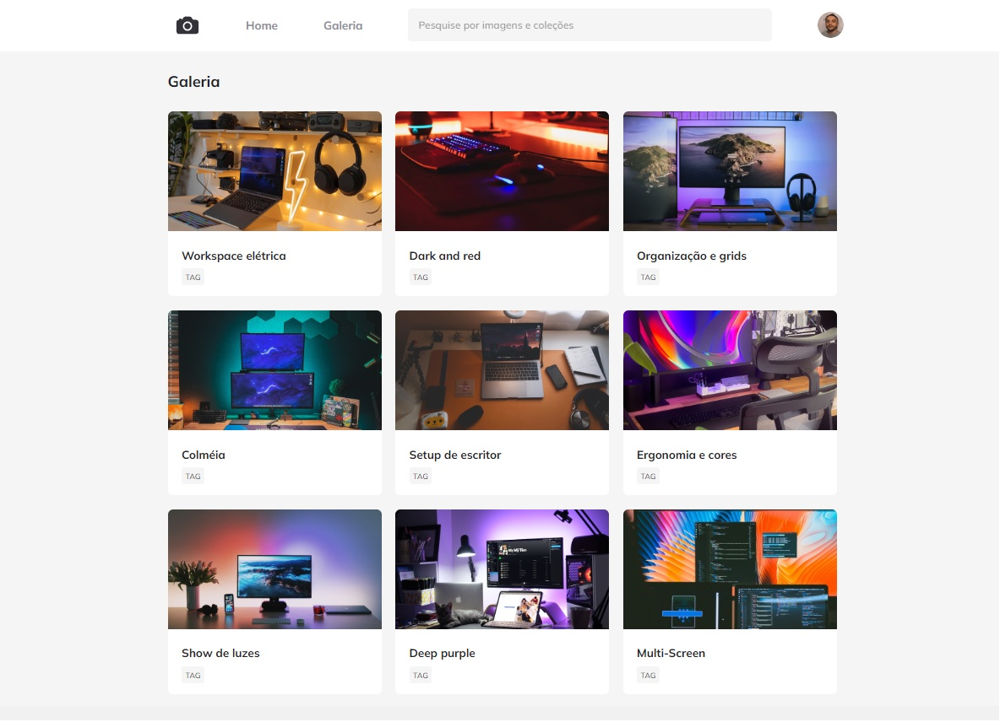

<h1 align="center"> Gallery Photo Animation </h1>

Evento exclusivo da plataforma e promovido pela Rocketseat para ensino de tecnologias WEB.

  <a href="#-tecnologias">Tecnologias</a>&nbsp;&nbsp;&nbsp;|&nbsp;&nbsp;&nbsp;
  <a href="#-projeto">Projeto</a>&nbsp;&nbsp;&nbsp;|&nbsp;&nbsp;&nbsp;
  <a href="#-layout">Layout</a>&nbsp;&nbsp;&nbsp;|&nbsp;&nbsp;&nbsp;
  <a href="#memo-licença">Licença</a>

  

 

  

## 🚀 Tecnologias

Esse projeto foi desenvolvido com as seguintes tecnologias:

- HTML e CSS
- Git e Github
- Figma

## 💻 Projeto

A galeria de foto é projeto que mostra a introdução e animação das imagens com saturação e usando GRID.

## 🔖 Layout

Você pode visualizar o layout do projeto através [DESSE LINK](https://www.figma.com/file/mnEnMejRflZVX23oQQKF6r/Fotoblog-%E2%80%A2-Projeto-Explorer-(Community)?node-id=201%3A95&mode=dev). É necessário ter conta no [Figma](https://figma.com) para acessá-lo.

##    Licença

Esse projeto está sob a licença MIT.

---

Feito com ♥ by: [Wagner Ferreira](https://www.instagram.com/wagnerffadm/)

